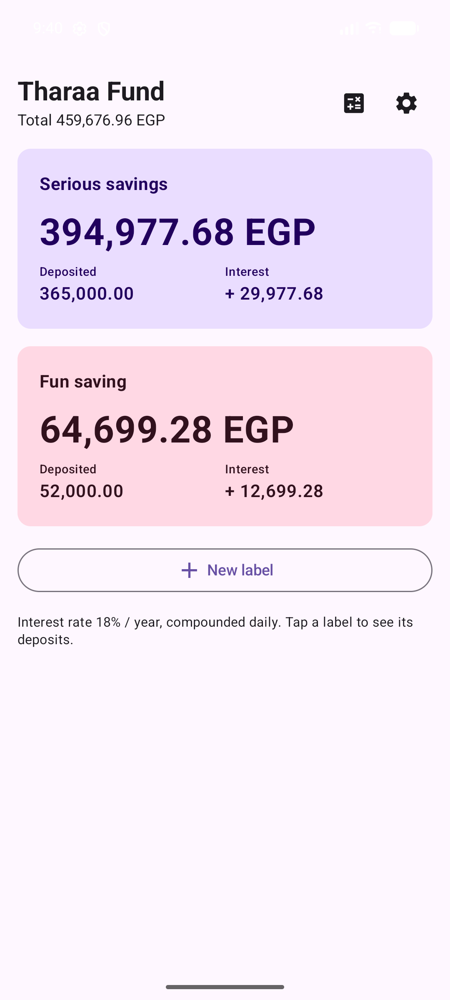
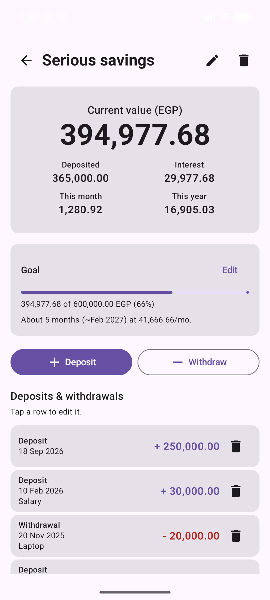
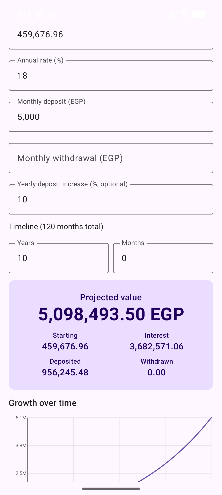

# Tharaa Fund

An offline-first Android app for tracking money held in a single Egyptian savings certificate, split into as many personal labels as you want. The bank reports one balance; this app keeps the buckets apart, compounds interest daily per label, and projects the balance forward.

Built with Kotlin and Jetpack Compose. No backend of its own, no analytics, and no account unless you opt into Drive backup. The ledger lives in one AES-256-GCM encrypted file on the device.

| Labels | Detail and goal | Projection |
|---|---|---|
|  |  |  |

## Why it exists

A Tharaa certificate pays a single daily-compounded rate on one pooled balance. If part of that balance is an emergency fund and part is holiday money, the bank statement cannot tell you how much of each you actually have, and the rate changes over time. This app does that arithmetic.

## Features

- **Labels.** Split one real balance into named buckets. Every deposit and withdrawal is tagged with a label; value, principal and earned interest are computed per label and summed on the home screen.
- **Daily-compounded interest with a rate schedule.** Interest is computed in `BigDecimal` over the exact rate that was in force on each day, so a mid-year rate change is applied from its effective date forward and never retroactively.
- **Goals.** Set a target per label and get a projected completion date based on your recent deposit pace.
- **Projection calculator.** Project the balance forward from a starting amount, annual rate, monthly deposit, monthly withdrawal and a yearly deposit increase. Results are broken into starting / deposited / withdrawn / interest and drawn as a growth chart. Scenarios can be named and saved for comparison.
- **App lock.** Optional 4-digit passcode with a salted hash (PBKDF2-HMAC-SHA256), plus optional biometric unlock. Release builds set `FLAG_SECURE`, so balances do not appear in the app switcher or in screenshots. Two deliberate gaps: the home-screen widget shows the combined total outside the lock, and the passcode is a device setting, so it is never written into a backup.
- **Monthly reminder.** An `AlarmManager` notification on a chosen day of the month, restored across reboots.
- **Home-screen widget.** Combined value, refreshed on every data change.
- **Backup and restore.** Passphrase-encrypted export/restore, a plain CSV export for spreadsheets, and optional Google Drive cloud backup with debounced auto-upload and 10 retained versions.

## Architecture

Single activity, single `@Composable` tree, no fragments and no navigation library. Simplicity is deliberate: the app is small enough that a `sealed interface Screen` and a `when` are easier to follow than a nav graph.

```
app/src/main/java/com/tharaa/savings/
  App.kt                 Process entry point: repository init, backup init, channel, reminder
  MainActivity.kt        The activity itself, and nothing else
  SavingsData.kt         The serialized model (transactions, labels, rates, presets, UI session)
  SavingsRepository.kt   Single source of truth; StateFlow in, encrypted JSON out
  SecureStore.kt         AES-256-GCM via the Android Keystore
  Interest.kt            Daily compounding across a rate schedule (BigDecimal)
  Projection.kt          Forward projection engine for the calculator
  Money.kt               Piastre minor-unit parsing and formatting
  PasscodeCrypto.kt      Salted passcode hashing
  BiometricAuth.kt       Biometric prompt wrapper
  Notifications.kt / ReminderReceiver.kt / ReminderScheduler.kt
  TharaaWidget.kt        App-widget provider
  TharaaBackupSource.kt  Adapter onto :backup-kit

  ui/Gate.kt             Passcode wall, and the unreadable-data recovery screen
  ui/LockScreen.kt       PIN keypad and biometric prompt
  ui/AppRoot.kt          Screen, and the when that dispatches it
  ui/HomeScreen.kt       Label cards and the combined total
  ui/LabelDetailScreen.kt  Value, goal, transactions, deposit/withdraw dialogs
  ui/CalculatorScreen.kt   Projection form, result card, hand-drawn chart
  ui/SettingsScreen.kt     Rate history, app lock, reminders, backup and restore
  ui/Common.kt           Shared dialogs, the ticking clock
  ui/Format.kt           Pure money, rate and date-window helpers (internal, so tested)

backup-kit/              Reusable, app-agnostic Google Drive backup library module
```

**Money is never a `Double`.** Amounts are `Long` piastres (minor units) end to end, and interest uses `BigDecimal`. Rates are basis points (`1800` = 18.00%).

**Persistence** is one encrypted file, `filesDir/savings.enc`, written on every mutation from a single background thread, and written synchronously in `onStop` because that is when the process may be killed. It is written to a temp file and renamed, so a kill part-way through cannot truncate it, and a file that exists but will not decrypt is never overwritten: the app refuses to write and says so. There is no Room or DataStore: the dataset is small, is always read in full, and must be encrypted as a unit. `android:allowBackup` is off, because a Keystore-sealed file restored onto another device could never be decrypted there.

The only state outside that file is two `SharedPreferences` in `:backup-kit`: the auto-backup flag and timestamp, and the Keystore-sealed Drive passphrase.

### `:backup-kit`

A separate Android library module that knows nothing about savings: no file under `com.backupkit` imports `com.tharaa`. A host app implements one interface, then drives it through `BackupManager`:

```kotlin
interface BackupSource {
    val projectId: String
    fun export(): ByteArray
    fun restore(bytes: ByteArray)
}
```

`BackupManager` then handles Google Sign-In, passphrase-based encryption, Keystore-sealed passphrase caching, Drive REST uploads over OkHttp, version pruning, and debounced auto-backup through WorkManager.

## Building

Requires JDK 17 and the Android SDK (compileSdk 35).

```bash
git clone https://github.com/IsmailAbbPort/Tharaa-Fund-Savings-Tracker.git
cd Tharaa-Fund-Savings-Tracker
./gradlew assembleDebug
```

Create a `local.properties` with `sdk.dir=/path/to/Android/Sdk`, or open the project in Android Studio and let it write one.

`./gradlew assembleRelease` runs R8 and resource shrinking. It signs the APK only if you add a `keystore.properties` (see `keystore.properties.example`); without one it still builds, just unsigned and therefore not installable.

Google Drive backup additionally needs an OAuth client ID registered for your signing certificate; without one, every other feature still works.

## Tests

```bash
./gradlew test
```

JVM unit tests cover interest compounding across rate changes and its window boundaries, minor-unit money parsing and formatting, the projection engine, passcode hashing, reminder scheduling arithmetic, serialization and legacy-file migration, session restore and its expiry, and the repository's pure read helpers. Several are regressions written against specific bugs and named after them.

Not covered yet, and worth knowing before you trust the suite: there is no `androidTest` source set, so nothing exercises the Compose layer or the Keystore path. `SecureStore` in particular is untested, because `AndroidKeyStore` exists neither on the JVM nor under Robolectric; testing it needs a seam between key acquisition and the file framing.

CI runs the tests, `lintVitalRelease` and a release build on every push and pull request.

## License

MIT. See [LICENSE](LICENSE).
